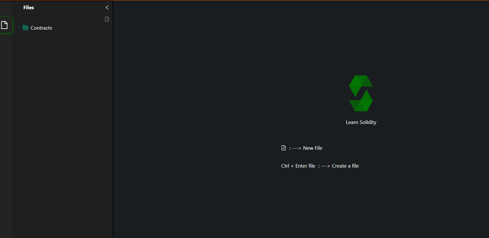
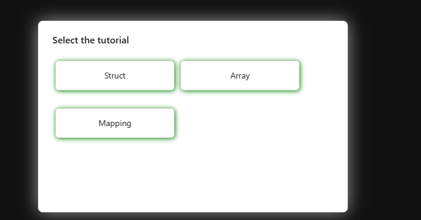
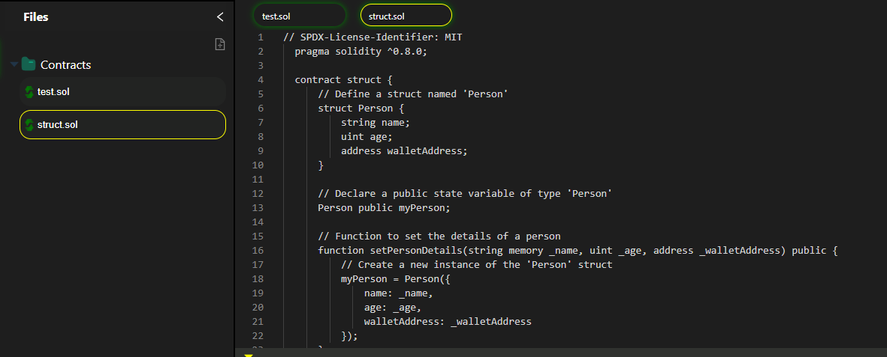
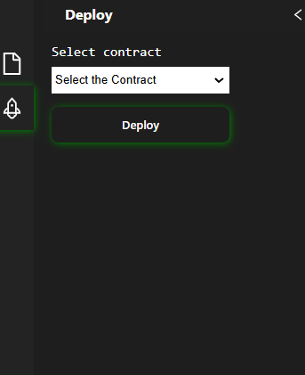
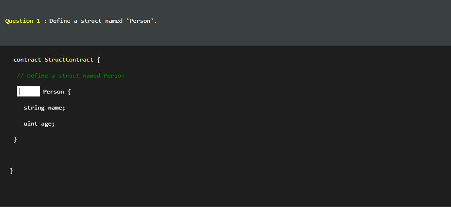
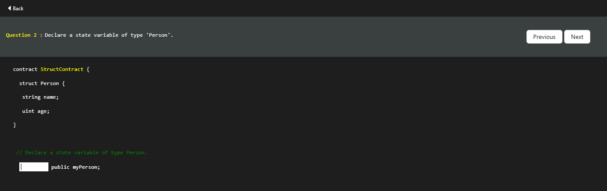
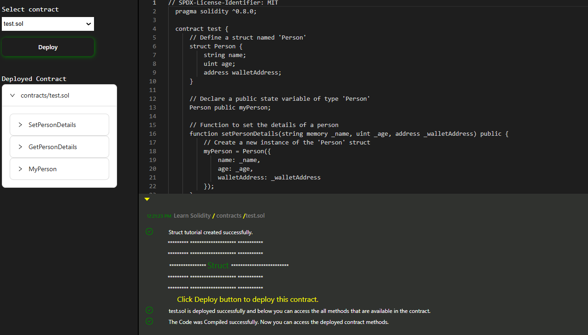
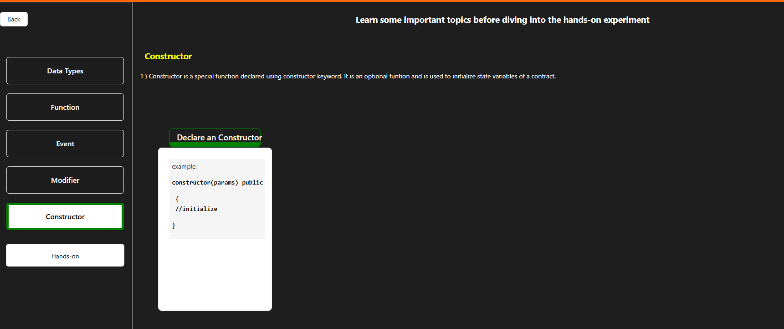
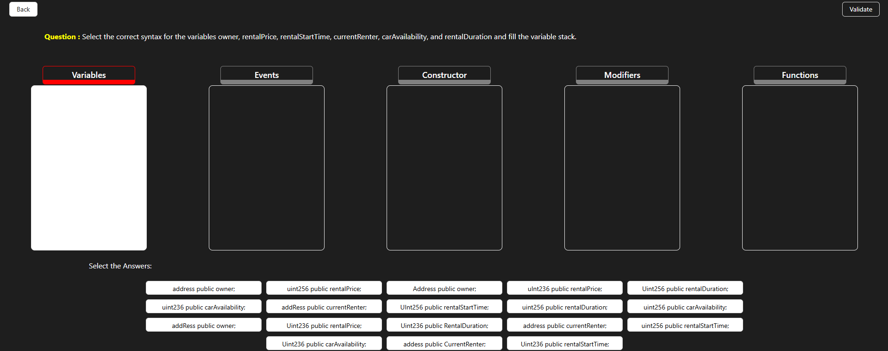

### Procedure
In this simulation, we are exploring the Solidity compiler to perform simple tasks using Solidity and to learn and explore "structs."

1. **Create a Solidity File:**  
   To create a Solidity file, click on the icon indicated in the Remix IDE. When prompted, enter the desired filename with the extension `.sol`. Then, press **Control + Enter** to confirm.  
   

2. **File Creation Confirmation:**  
   Once the file is successfully created, you will see it appear in the file explorer.  
   

3. **Select a Tutorial:**  
   You can now observe three options indicating tutorials on **structs**, **arrays**, and **mappings**. Select one of the tutorials to learn the syntax.  
   

4. **Review Struct Syntax:**  
   Observe the syntax of structs provided in the tutorial and carefully read the instructions.  
   

5. **Deploy the Contract:**  
   Click the **Deploy** icon to deploy the smart contract. Make sure the code is complete and error-free before deploying.  
   

6. **Complete the Exercise:**  
   To proceed, complete the exercise by filling in the blanks in the code as instructed.  
   

7. **Observe and Continue:**  
   Review the corrected code after completing the exercise. Click the **Next** button to continue with the tutorial.  
   

8. **Final Deployment:**  
   After completing the exercise, go to the **Deploy** icon and deploy the final smart contract. Ensure all tasks are completed as per the instructions in the tutorial.  
   

9. **Click the "Handson" Button:**  
   Once you are ready, click the **Handson** button to start the hands-on exercise. This will provide practical experience with the concepts you’ve just learned.  
   

10. **Observe and Learn the Topics Before Doing Hands-On:**  
    Before proceeding with the hands-on exercise, take a moment to review and observe the topics provided. Understanding the concepts before starting will ensure better results and clarity during the hands-on session.  
    

11. **Complete the Hands-On Exercise and Validate:**  
    After finishing the hands-on exercise, click the **Validate** button to check your work and ensure that everything is correct. This will confirm whether your implementation is accurate.  
    
