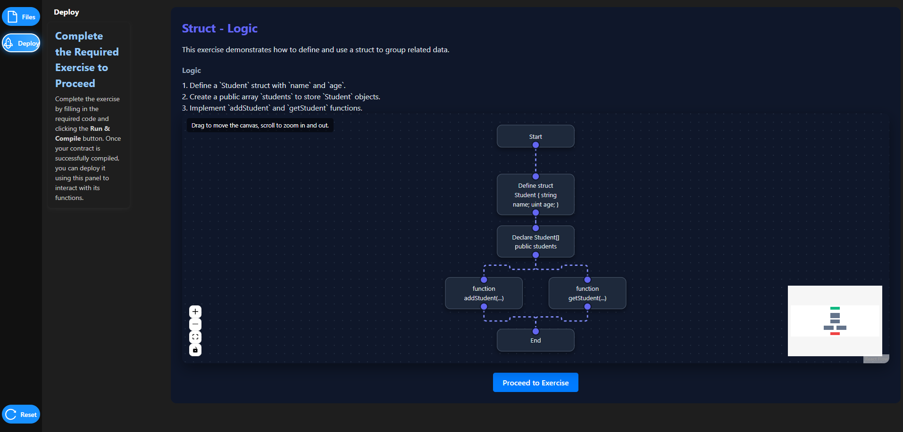
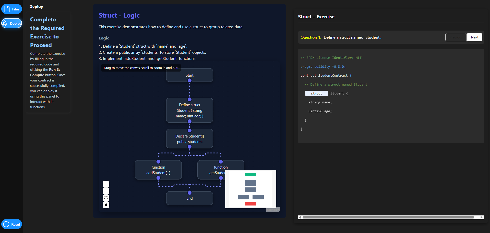
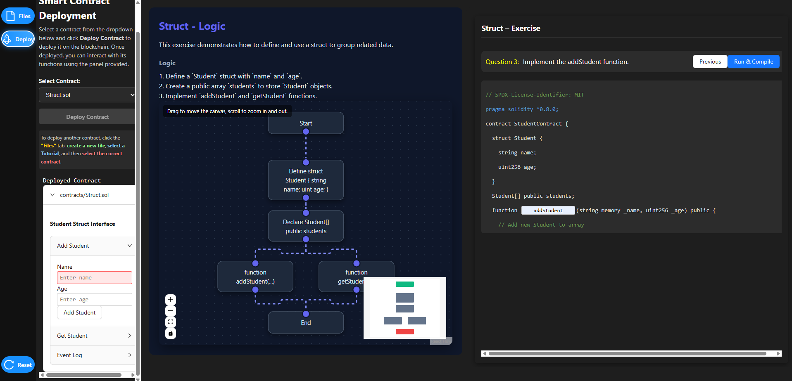

This simulation introduces **advanced smart contract writing** by demonstrating the implementation of **structs**, **arrays**, and **mappings** to organize and manage on-chain data. Learners will define structured data, store multiple records, and interact with deployed smart contracts.

#### Step 1: Select a Tutorial (Struct.sol)

- Click the **Files** button in the left sidebar.
- Under the **Contracts** section, select **`Struct.sol`**.
- The **Advanced Smart Contract Development** welcome screen is displayed, confirming the tutorial is loaded.

<div></div>

#### Step 2: Review Logic and Flowchart

- After selecting `Struct.sol`, the **Struct – Logic** page opens.
- Observe the interactive flowchart that visually represents the conditional execution flow:
  - You can drag the canvas to move the flowchart.
  - Scroll to zoom in or out for better visibility.
- Click **Proceed to Exercise** after understanding the execution flow.

<div></div>

#### Step 3: Define the Student Struct (Exercise – Question 1)

- The **Struct – Exercise** panel appears on the right side of the screen.
- **Question 1** asks you to define a struct named Student.
- Enter the required `struct` keyword to complete the struct definition as shown.
- Click the **Next** button to proceed to the next exercise.

<div>
  
</div>

#### Step 4: Declare the Student Array (Exercise – Question 2)

- **Question 2** asks you to declare an array of type `Student`.
- Add the following declaration to store multiple student records:

   ```solidity
   Student[] public students;
   ```

- Click **Next** to proceed.

<div></div>

#### Step 5: Implement the addStudent Function (Exercise – Question 3)

- **Question 3** requires implementing the `addStudent` function.
- Click **Run & Compile**.
- If the code is correct, the compilation will succeed.

<div></div>

#### Step 6: Deploy the Smart Contract

- After successful compilation, the Smart Contract Deployment panel becomes active.
- Select `Struct.sol` from the contract dropdown.
- Click **Deploy Contract**.
- A Deployed Contract section appears, confirming successful deployment.

<div></div>

#### Step 7: Interact with the Deployed Contract

- In the Student Struct Interface:
  - Enter a Name.
  - Enter an Age.
  - Click **Add Student** to store the data on-chain.
- Use **Get Student** to retrieve stored student details.
- Observe the returned values and event logs.

<div></div>

#### Continuing with the Remaining Smart Contract

After successfully completing the Struct tutorial, repeat the same procedure for the remaining tutorials:

- Select **Array.sol** to practice working with dynamic and fixed-size arrays, including looping constructs such as for and while loops.
- Select **Mapping.sol** to explore key-value storage, advanced mapping patterns, and their use in creating efficient data retrieval structures.
